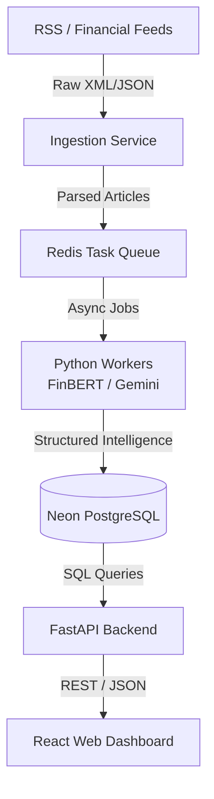
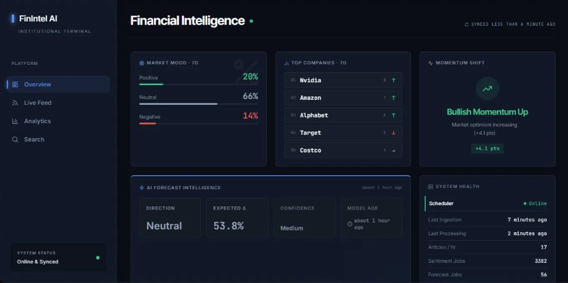
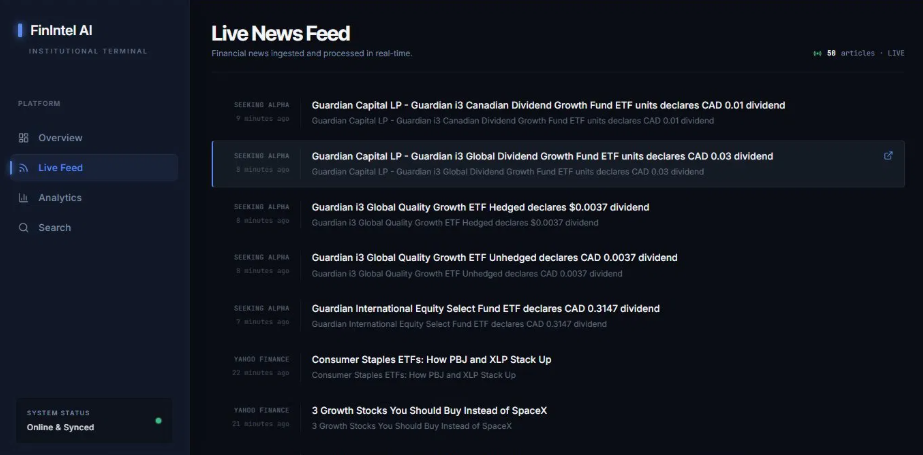
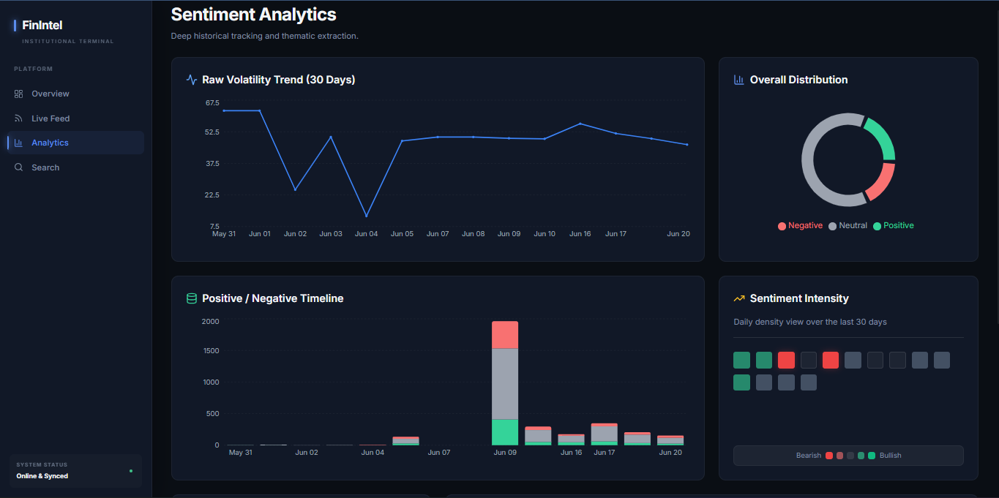
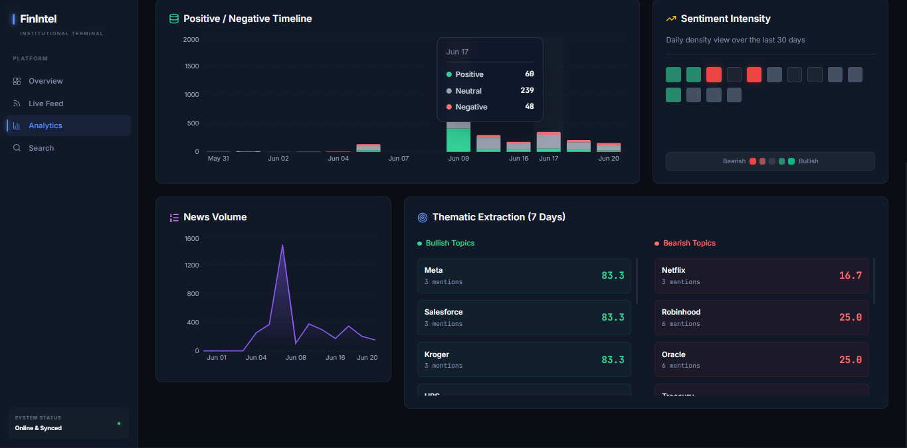
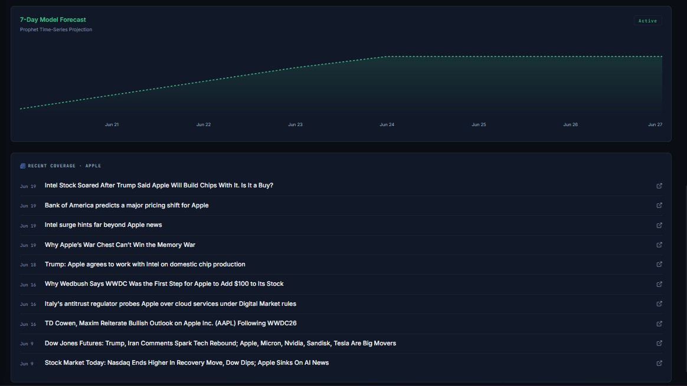
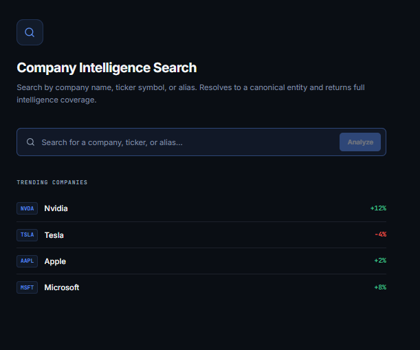
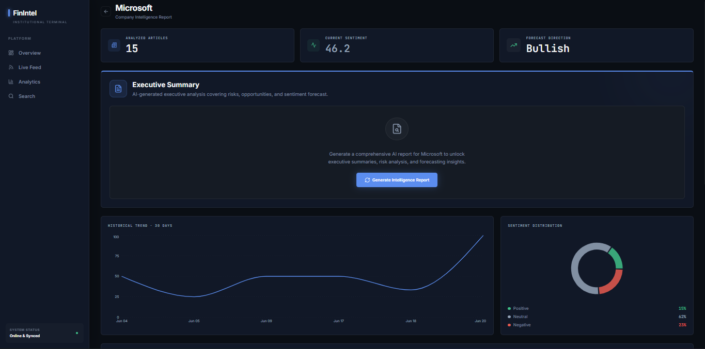
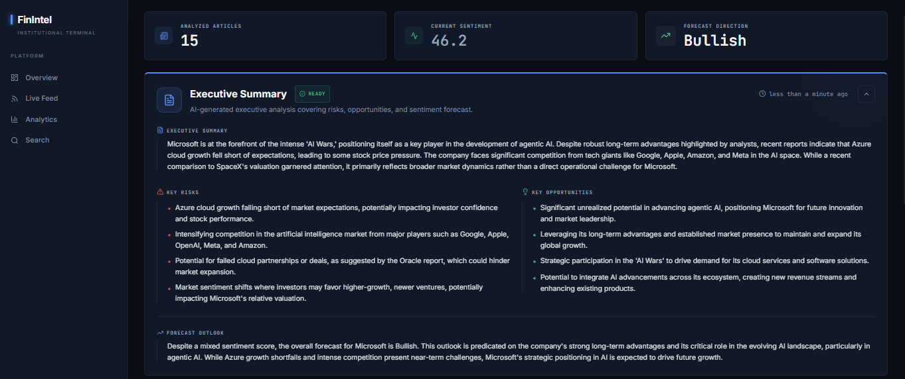

# FinIntel AI

**FinIntel AI** is an institutional-grade, automated market intelligence platform. It continuously ingests financial news, extracts entities, analyzes thematic sentiment using specialized NLP models, and forecasts market momentum. The platform synthesizes millions of data points into actionable intelligence, delivered through a high-performance real-time dashboard.

---

## Live Demo

https://finintell.netlify.app/

## Key Features

* **Real-Time News Ingestion:** Automated aggregation of live financial feeds, structured and processed the moment news breaks.
* **Deep Sentiment Analysis:** Utilizes **FinBERT**, a financial-domain-specific language model, to accurately score market sentiment, extracting nuanced bullish and bearish signals.
* **Thematic Entity Extraction:** Automatically identifies companies, tickers, and market actors within unstructured text, mapping sentiment directly to the relevant entities.
* **AI-Powered Intelligence Reports:** Leverages **Google Gemini** to generate concise, human-readable executive summaries for any company on demand.
* **Predictive Forecasting:** Employs time-series projection algorithms to forecast short-term sentiment momentum and market direction.
* **Institutional Dashboard:** A fully responsive, dark-themed React terminal providing live feeds, sentiment heatmaps, volatility tracking, and historical analytics.

---

## System Architecture

FinIntel is built on a highly scalable, event-driven microservices architecture designed to handle continuous data streams without blocking the user-facing application.



---

## Technology Stack

FinIntel is a modern monorepo combining a high-performance Python data pipeline with a responsive TypeScript frontend.

**Frontend (Client Terminal)**
* **Framework:** React 19 + TypeScript + Vite
* **Styling:** TailwindCSS + Custom CSS Variables for rapid theming
* **State Management:** React Query (TanStack) for caching and live polling
* **Data Visualization:** Recharts for responsive, interactive charting
* **Icons:** Lucide React

**Backend (API & Data Pipeline)**
* **API Framework:** FastAPI (Python 3.11+)
* **ORM:** SQLAlchemy 2.0
* **Database:** PostgreSQL (Hosted on Neon)
* **Task Queue:** Redis + RQ (Redis Queue)
* **AI/ML:** HuggingFace `transformers` (FinBERT) + `google-generativeai` (Gemini Pro)

---

## Repository Structure

The codebase is organized as a monorepo containing several independent applications and shared packages.

```text
├── apps/
│   ├── api/          # FastAPI backend server (Endpoints & Routing)
│   ├── ingest/       # RSS news ingestion service
│   ├── scheduler/    # Orchestrator for recurring ingestion/processing jobs
│   ├── web/          # React/Vite frontend application
│   └── worker/       # Redis RQ task workers (NLP, LLM, Forecasting)
├── packages/
│   ├── db/           # Shared SQLAlchemy models and database connection utilities
│   ├── llm/          # Google Gemini integration and prompting logic
│   └── sentiment/    # FinBERT analysis modules and extraction logic
└── scripts/          # Local development and database maintenance scripts
```

---

## Screenshots

### Dashboard


### Live Feed


### Analytics



### Company Intelligence


### Search




---

## Local Development Setup

To run the entire FinIntel platform locally, you will need **Python 3.11+**, **Node.js 18+**, and instances of **PostgreSQL** and **Redis** running on your machine (or remotely).

### 1. Environment Configuration
Duplicate the `.env.example` files found in the respective application directories (`apps/api`, `apps/web`, `apps/worker`) and rename them to `.env`. Ensure your `DATABASE_URL`, `REDIS_URL`, and `GEMINI_API_KEY` are configured correctly.

### 2. Install Dependencies

**Frontend:**
```bash
cd apps/web
npm install
```

**Backend & Services:**
```bash
# It is highly recommended to use a virtual environment
pip install -r apps/api/requirements.txt
pip install -r apps/worker/requirements.txt
```

### 3. Launching the Platform (Windows)
A convenience script is provided to start all microservices, workers, and the frontend simultaneously in separate terminal windows.

```powershell
.\scripts\start_all.ps1
```

Once running, the client terminal will be available at `http://localhost:5173`.

---

## Deployment

FinIntel is designed to be deployed across modern, serverless, and containerized cloud providers:

* **Client Dashboard:** Deployed globally on **Netlify**.
* **API & Workers:** Containerized and deployed on **Render** (Python runtime).
* **Database:** Serverless Postgres hosted on **Neon.tech**.
* **Queue:** Managed **Redis** instance.
